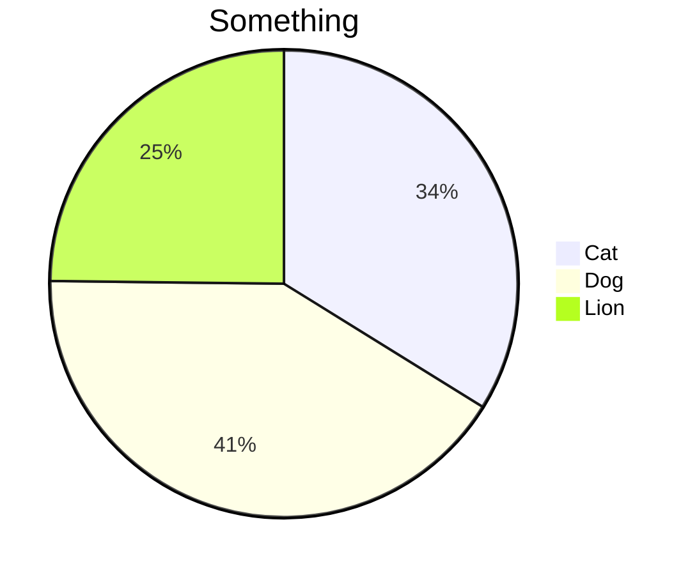
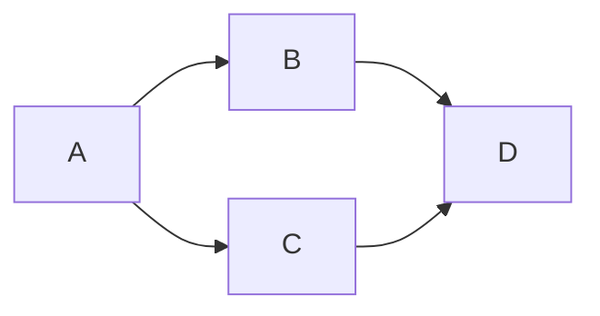

Note Type :: #📘 <br>
Topics :: [[MOC]]<br>
Parent Link :: [[使用規則]]<br>

---
# Markdown 語法

## Markdown 語法
### Heading
> # H1
> ## H2
> ### H3
> #### H4
> ##### H5
> ###### H6

### List
> - list
> - list
> - list

> + list
> + list
> + list

> 1. list
> 2. list
> 3. list

### Quote
> Quote...

### 超連結
> [something](someurl)

### 圖片超連結
> 

### 粗體
> **粗體**

### 斜體
> *斜體*

### 粗斜體
> ***粗斜體***

### 螢光強調
> ==螢光強調==

### 待辦清單
> - [ ] something
> - [x] something

### 分隔線
> ---

### 程式碼區塊
```c++
printf();
```

### Mermaid




### LaTeX
> $$\frac{\sin(x)}{x}$$

### Table
| first | second | third |
| ----- | ------ | ----- |
| 1     | 2      | 3     | 
