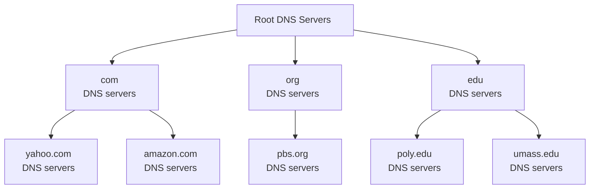
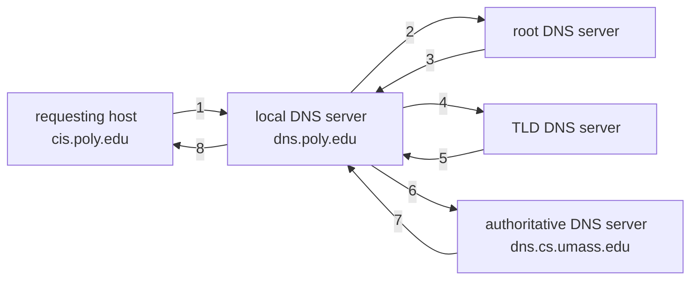
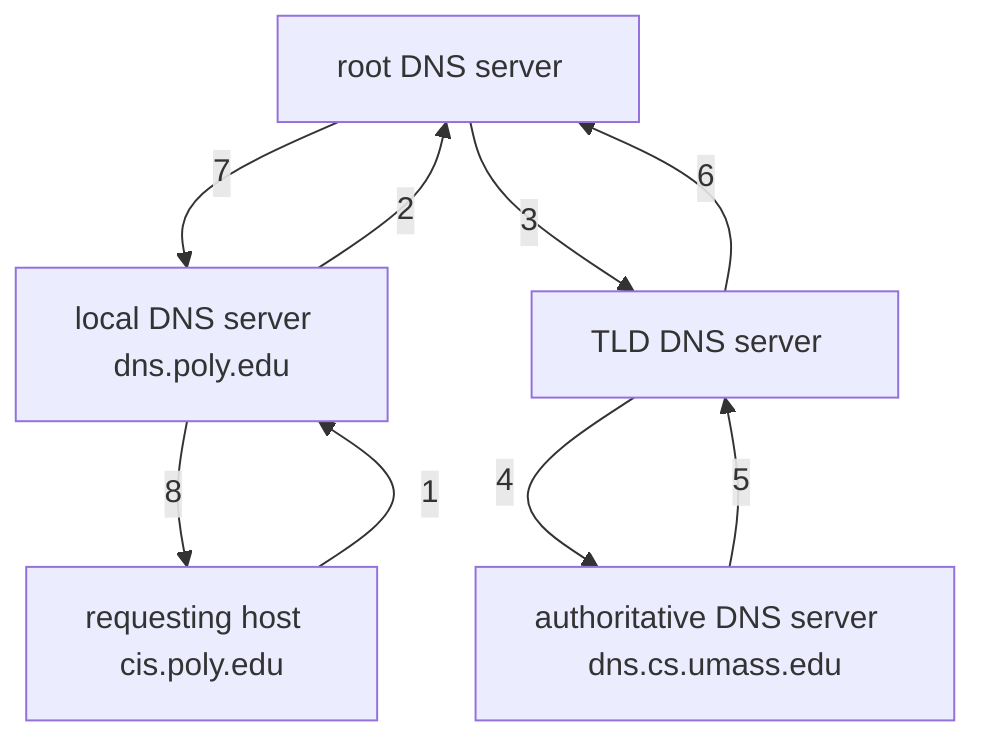

Source Type :: #📥/📄  
Note Type :: #📝  
Topics :: [[📶Computer Networking]] 
Parent Link :: [[📶Application Layer]] 

---
# 📶DNS — The Internet’s Directory Service
+ DNS 可以指：
	+ distributed database
		+ 實做成 DNS server 階層架構的分散式資料庫。
	+ application-layer protocols
		+ 一種讓 hosts 可以查詢此一分散式資料庫應用層協定。

## DNS Services
+ **hostname** to **IP Address** translation
+ Hostname aliasing
	+ 名稱很複雜的 hostname 可以擁有多個 alias name
	+ canonical hostname（正規主機名稱）: 原本的 hostname
	+ Example: 
		+ **canonical hostname:** <small>relay1.west-coast.enterprise.com</small>
		+ **alias name:** <small>enterprise\.com, www\.enterprise\.com...</small>
+ Mail server aliasing
	+ mail server hostname 的 alias name
+ Load distribution（負載分配）
	+ 若網站擁有多台 server 可使用（多個 IP Address 共用一個 name），則當該網站流量高時，DNS 可以自動分配空閒的 server 給 client。

## Overview of How DNS Works
+ The problems with a centralized design
	+ **A single point of failure:** 如果 DNS server 掛了，整個網路也掛了。
	+ **Traffic volume:** 單一 server 需要處理所有（大量）的 DNS 查詢。
	+ **Distant centralized database:** 距離造成 delay。
	+ **Maintenance:** 資料量龐大，難以維護。
	+ 結論: <u>doesn't scale</u>（無法擴充）

### A Distributed, Hierarchical（階層式） Database
+ DNS classes
	1. root（根） DNS servers
	2. top-level domain (TDL)（高階網域） DNS servers
	3. authoritative（官方） DNS servers

+ Example: client wants IP for www\.amazon\.com
	1. client queries root server to find com DNS server
	2. client queries .com DNS server to get amazon.com DNS server
	3. client queries amazon.com DNS server to get IP address for www\.amazon\.com

#### Root DNS Servers
+ 共 13 個 logical root name (\<A to M\>.root-servers.net)，分別由 13 個不同的組織管理。
+ 世界各地都有各個 root name server 的鏡像。
+ [root name server list](https://en.wikipedia.org/wiki/Root_name_server#Root_server_addresses)

#### TLD DNS Servers
+ 包含高階網域 com, org, sdu, gov...，與所有國家級的高階網域 uk, fs, ca, jp...，都有 TLD Servers。
	+ com 高階網域的 TLD Server 由 Verisign Global Registry Services 公司負責維護。
	+ edu 高階網域的 TLD Server 由 Educause 公司負責維護。

#### Authoritative DNS Servers
+ 所有機構，只要有 publicly accessible hosts on the Internet，就必須提供 publicly accessible DNS records, which mapping hostnames to IP Address。
+ DNS records can be stored in
	+ DNS Servers maintained by organization, university, company...
	+ 某家 service provider（服務供應商） 的 DNS Server 中（付費）。

#### Local DNS Name Servers
+ 不屬於 servers 階層架構中
+ each ISP has one
	+ alos called **default name server**
+ when host makes DNS query, query is sent to its local DNS server
	+ acts as proxy, forward query into hierarchy

### DNS name resolution example
host at cis.poly.edu wants IP address for gaia.cs.umass.edu

#### iterated query（實務上較常使用）

+ 從上游的 server 得到下游的 server name，在不斷迭代到找到目標 server 為止。
	+ "I don't know this name, but ask this server"

#### recursive query

### DNS Caching
+ DNS server 可以將查詢過的某一對 hostname／IP address 快取在 server 中
	+ local DNS server 也可以快取 authoritative server, TLD server 的 IP address
+ 一段時間後 DNS server 會丟棄其快取的資訊（通常設定為 2 天）

## DNS Records and Messages
### DNS Records
+ distribute database (DNS) storing resource records (RRs（資源紀錄）)
+ RR format: $(Name,\ Value,\ Type,\ TTL)$
	+ $TTL$ 是 RR 存活的時間，以下範例中將會省略。

#### Type=A
+ **name:** hostname
+ **value:** IP address
+ example
	+ (relay1.bar.foo.com, 145.37.93.126, A)

#### Type=NS
+ **name:** domain
+ **value:** hostname of authoritative name of server of this domain
+ example
	+ (foo.com, dns.foo.com, NS)

#### Type=CNAME
+ **name:** alias name of **value**
+ **value:** canonical name （除了 mail server 以外的 server）
+ example
	+ (foo.com, relay1.bar.foo.com, CNAME)

#### Type=MX
+ **name:** alias name of **value**
+ **value:** canonical name of mail server
+ example
	+ (foo.com, mail.bar.foo.com, MX)

### DNS Messages
**query** and **reply** messages, which are the only two kinds of DNS messages, both with same message format.

![[DNS message format.excalidraw]]

<table align="center">
	<tr align="center">
		<td>identification</td>
		<td>flags</td>
	</tr>
	<tr align="center">
		<td>Number of questions</td>
		<td>Number of answer RRs</td>
	</tr>
	<tr align="center">
		<td>Number of authority RRs</td>
		<td>Number of additional RRs</td>
	</tr>
	<tr align="center">
		<td colspan="2">questions (variable number of questions)</td>
	</tr>
	<tr align="center">
		<td colspan="2">answers (variable number of RRs)</td>
	</tr>
	<tr align="center">
		<td colspan="2">authority (variable number of RRs)</td>
	</tr>
	<tr align="center">
		<td colspan="2">additional info (variable number of RRs)</td>
	</tr>
</table>

+ header section: 12 bytes
	+ identification（識別代碼）: 16 bit number for query, reply to query uses same number
	+ flags:
		+ query(0) or reply(1)
		+ reply is authoritative(1): 是否為 DNS server 所查詢之名稱的 authoritative server
		+ recursion desired (1): 希望 DNS server 能在沒有 records 時，用遞迴進行查詢
		+ recursion available (1): 若 DNS server 支援遞迴式查詢
	+ 剩下四個 number-of fields，指出在 header section 之後出現的 section 的數量。
+ question section: 正在進行的 query 的相關資訊
	+ **a name field:** 存放正在查詢的 name
	+ **a type field:** 指出對該 name 所 query 的問題類型
		+ e.g. Type A, Type MX...
+ answer section
	+ 
+ authority section
	+ 
+ additional section
	+ 