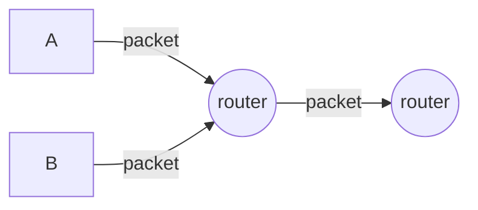
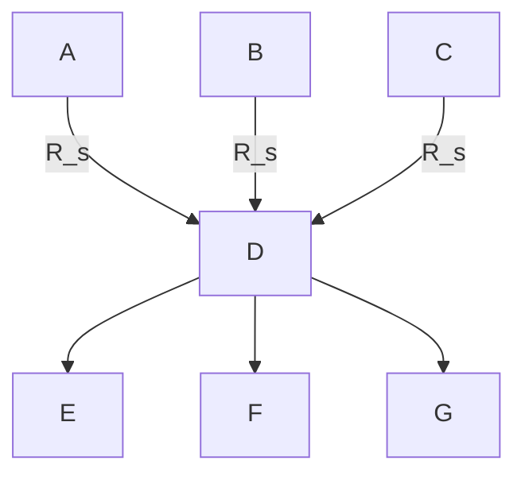

Source Type :: #📥/📄  
Note Type :: #📝  
Topics :: [[📶Computer Networking]] 
Parent Link :: [[📶Computer Networks and the Internets]] 

---
# 📶Delay, loss, throughput in networks

## Delay types

+ **Nodal processing delay:** 檢查 packet header 並判斷要送往何處、對 packet 進行 error check。
	+ 通常是等於或小於 micro seconds。
+ **Queueing delay:** [[📶Network Core#Queueing delay packet loss]]
	+ 通常是 micro seconds 到 milli seconds。
+ **Transmission delay:** [[📶Network Core#Store and forward transmission]]
	+ 通常是 micro seconds 到 milli seconds。
+ **Propagation delay:** 從前一個 link 開端傳送到下一個 router 的時間。
	+ 通常是 milli seconds。
	+ 傳播速率介於 $2 \times 10^8 \ \ m/s$ ～ $3 \times 10^8 \ \ m/s$ 之間。

### transmission delay vs. propagation delay
| Transmission delay                                                              | Propagation delay                                   |
| ------------------------------------------------------------------------------- | --------------------------------------------------- |
| router 將 packet 送出所需的時間。（從接收到 packet bit 到收完所有 packet bits） | packet 從前一個 router 到下一個 router 所需的時間。 |

## Queueing delay
![[traffic intensity.png]]

+ Premise
	+ **R:** link bandwidth (bps)
	+ **L:** packet length (bits)
	+ **a:** average packet arival rate （packet 到 queue 的平均速率）
	+ 假設 queue 的容量 $\bf{\approx \  \infty}$
	* **La:** bit 抵達 queue 的平均速率
	* **La/R:** traffic intensity（流量強度）

- Result
	- **La/R $\bf{\approx}$ 0:** queueing delay small $\approx$ 0
	- **La/R $\bf{\to}$ 1:** queueing delay big $\approx \  \infty$
	- **La/R $\bf{>}$ 1:** 會造成 queue 無止盡的增長。
	- example:
		- 若每隔 (L/R)N 秒就有 N 個 packets 到達，第 n 個傳送的 packet 就有 (n-1)L/R 秒的 queueing delay。

## End-to-end delay
+ Premise
	+ source 到 destnation 之間有 N - 1 個 router
	+ 假設網路是暢通的（queueing delay 可以忽略）
	+ **processing delay: ** $d_{proc}$
	+ **transmission delay: ** $d_{trans} = L/R$
	+ **propagation delay: ** $d_{prop}$

- Result
	- $d_{end-end} = N(d_{proc} + d_{trans} + d_{prop})$

### Traceroute

## Throughput
+ **throughput:** 從 sender 傳送到 receiver 的速率。
	+ **instantaneous（瞬間）:** rate at given point in time.
	+ **average（平均）:** rate over longer period of time.

### 水管

+ Premise
	+ **$\bf{R_{c}}$:** server 到 router 的 link rate
	+ **$\bf{R_{s}}$:** client 到 router 的 link rate

- Result
	- $R_s < R_c$
		- server 到 router 後沒有 delay 直接傳出去
		- 產出率為 $R_s$
	- $R_s > R_c$
		- server 到 router 後會以 $R_c$ 的速率傳出去
		- data 會積在 router，可能造成 packet loss
		- 產出率為 $R_c$

	* In general，產出率為 $min\{R_s, R_c\}$，此即為 bottleneck link（瓶頸連結）的傳輸速率。

### Internet scenario（設想）
