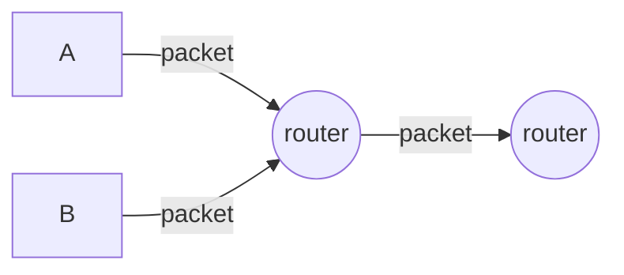

Source Type :: #📥/📄  
Note Type :: #📝  
Topics :: [[📶Computer Networking]] 
Parent Link :: [[📶Computer Networks and the Internets]] 

---
# 📶Delay, loss, throughput in networks

## Delay types

+ **Nodal processing delay:** 檢查 packet header 並判斷要送往何處、對 packet 進行 error check。
	+ 通常是等於或小於 micro seconds。
+ **Queueing delay:** [[📶Network Core#Queueing delay packet loss]]
	+ 通常是 micro seconds 到 milli seconds。
+ **Transmission delay:** [[📶Network Core#Store and forward transmission]]
	+ 通常是 micro seconds 到 milli seconds。
+ **Propagation delay:** 從前一個 link 開端傳送到下一個 router 的時間。
	+ 通常是 milli seconds。
	+ 傳播速率介於 $2 \times 10^8 \ \ m/s$ ～ $3 \times 10^8 \ \ m/s$ 之間。

### transmission delay vs. propagation delay
| Transmission delay                                                              | Propagation delay                                   |
| ------------------------------------------------------------------------------- | --------------------------------------------------- |
| router 將 packet 送出所需的時間。（從接收到 packet bit 到收完所有 packet bits） | packet 從前一個 router 到下一個 router 所需的時間。 |

## Queueing delay & packet loss
+ Premise
	+ R: link bandwidth (bps)
	+ L: packet length (bits)
	+ a: average packet arival rate （packet 到 queue 的平均速率）

- Result
	- La/R ~
	- La/R
	- La/R