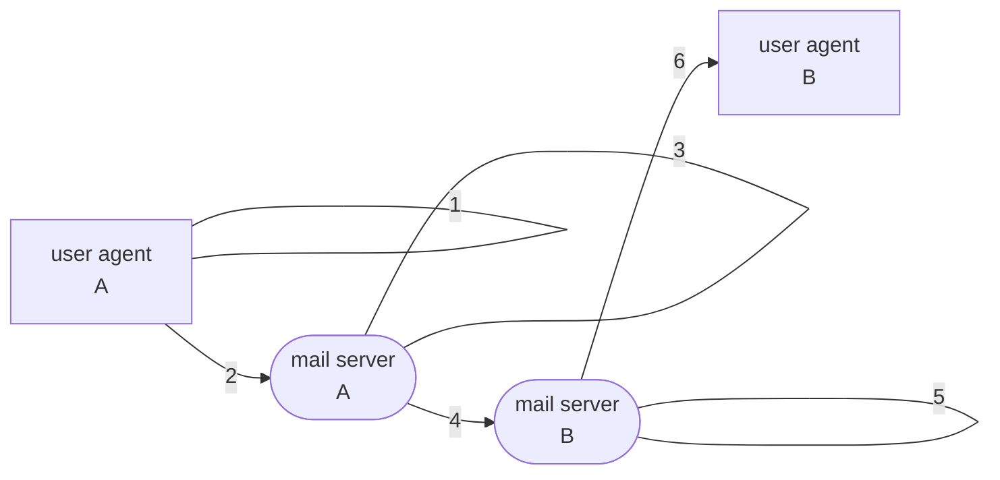

Source Type :: #📥/📄  
Note Type :: #📝  
Topics :: [[📶Computer Networking]] 
Parent Link :: [[📶Application Layer]] 

---
# 📶Electronic Mail in the Internet

+ three components
	+ user agents (mail reader)
		+ composing, editing, reading mail messages
		+ e.g. Outlook, Thunderbird, iPhone mail client
	+ mail servers
		+ components
			+ **mailbox:** contains incoming messages for user
			+ **message queue:** queue of outgoing nail messages
		+ for "client": sending mail server
		+ for "server": receiving mail server
	+ protocols
		+ e.g. SMTP (Simple Mail Transfer Protocol)

## SMTP (Simple Mail Transfer Protocols) \[RFC 2821\]

+ use TCP to reliable transfer email message from client to server (port 25)
+ **direct sending:** sending server to receiving server
+ phases of transfer
	+ handshaking
	+ transfer of messages
	+ closure
+ interaction format
	+ commands (client): ASCII text
	+ response (server): status code and phrase
+ ==messages must be in 7-bit ASCII== （缺點）

### Example

1. A invokes its **user agent**, provides **B’s e-mail address**, **composes a mail**, and instructs the user agent to send the mail.
2. A's user agent send mail to A's **mail server**, placing in **message queue**
3. A's mail server (client) opens **TCP connection** with B's mail server (server)
4. A's mail server **send mail data** over TCP connection
5. B's **mail server** places mail in **mailbox**
6. B invokes its **user agent** to **read mail**

#### Sample SMTP interaction

+ init TCP connection
+ S: 220 \<server-name\>
+ C: HELO \<client-name\>
+ S: 250 Hello \<client-name\>, pleased to meet you
+ C: MAIL FROM: \<\<client-user-name@client-name\>\>
+ S: 250 \<client-user-name@client-name\> ... Sender ok
+ C: RCPT TO: \<\<server-user-name@server-name\>\>
+ S: 250 \<server-user-name@server-name\> ... Recipient
+ C: DATA
+ S: 254 Enter mail, end with "." on a line by itself
+ C: Do you linke ketchup?
+ C: How about pickles?
+ C: .
+ S: 250 Message accepted for delivery
+ C: QUIT
+ S: 221 \<server-name\> closing connection

## Comparison with HTTP
