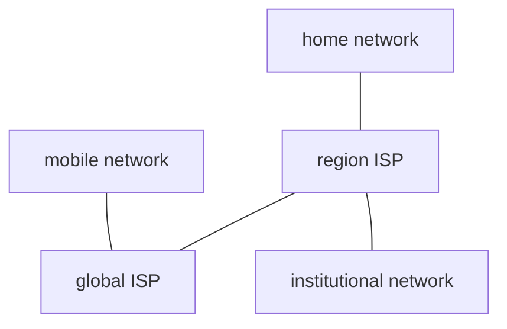

Source Type :: #📥/📄  
Note Type :: #📝  
Topics :: [[📶Computer Networking]] 
Parent Link :: [[📶Computer Networking]] 

---
# 📶Introduction

## What's the Internet

+ **hosts** = **end systems**
+ communication links
	+ via fiber, copper, radio, satellite...
	+ transmission rate: **bandwidth** (bps)

### "nuts and bolts" view

![[nuts and botls of internet.excalidraw]]

+ **Internet:** "network of networks"
	+ Interconnected ISPs
+ protocols: TCP, IP, HTTP, 802.11...
+ Internet standards
	+ RFC: Request for comments
	+ IETF: Internet Engineering Task Force

> #### IoT
> + IoT (Internet of Things) （物聯網）
> + IIoT (Industrial IoT) （工業物聯網）
> + VoIP (Voice over IP) （語音）

### a service view
+ infrastructure（基礎設施） that provides services to applications:
	+ Web, VoIP, email, games, e-commerce, social nets...

## What's a Protocol

**Definition:** define `format`, `order of messages sent and received among network entities`, and `actions taken on message transmission, receipt`
