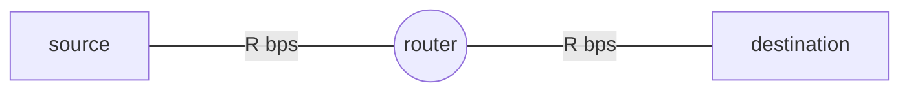
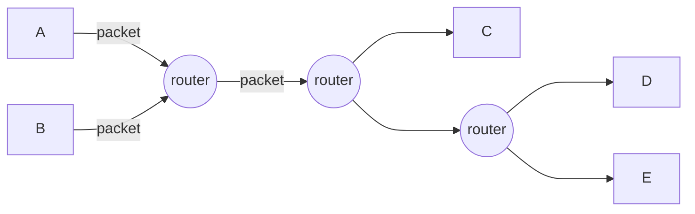

Source Type :: #📥/📄  
Note Type :: #📝  
Topics :: [[📶Computer Networking]] 
Parent Link :: [[📶Computer Networks and the Internets]] 

---
# 📶Network Core
**Definition:** composed of packet switch and links, which is interconnecting the hosts (network edge) 

## Packet switching
**Definition:** Interchanging messages between hosts. 
&nbsp;&nbsp;&nbsp;&nbsp;**Packet:** smaller chunks of data from long messages.

+ Packets interchanged by <u>packet switch（封包交換器）</u>
	+ router
	+ link-layer switches

### Store and forward transmission
**Definition:** 交換器要先接收到完整的封包，才會繼續往下傳輸。 

+ Takes $\bf{\frac{L}{R}}$ seconds to transmit **L**-bit packet into link at **R** bps.
+ **store and forward:** entire packet must arrive at router before it can be transmitted on next link.
	+ resulting in **delay: $\bf{\frac{L}{R}}$**
	+ end-end delay: （視其他 delay 為 0）
		+ $(\ packet數 - 1 + link數\ ) \times \frac{L}{R}$

### sources -> router -> destinations

#### Queueing delay & packet loss
router 還在處理前一個 packet 時，有另一個 packet 被傳過來，後面的 packet 會在 output buffer 裡暫存。

+ **Queueing delay:** 等上一個 packet 傳送完的 delay。
+ **Packet loss:** 當 buffer 滿的時候，又有 packet 傳送過來，就會造成 packet 內容遺失。

#### Forwarding table & Routing protocols
+ **Forwarding table:** router 根據 ip address 查詢通向 destination 的下一個 router 在哪。
+ **Routing Protocols:** 設定 forwarding table 用的 protocols。

## Circuit Switching
+ 要傳送 data 時，佔一條線路，佔了之後別人就不能用這條線了。
+ 比起 packet switching，效率較差，但較穩定。
+ Example: 傳統電話網路

|                ![[circuit switching.excalidraw]]                 |
|:----------------------------------------------------------------:|
| A to B: end-to-end connection |

### Multiplexing: <small>實做 circuit switching</small>
+ FDM (Frequency-Division Multiplexing): 以 frequency 當作 circuit
+ TDM (Time-Division Multiplexing): 以 time slot 當作 circuit

![[FDM & TDM.excalidraw]]

## Packet Switching vs. Circuit Switching
### Example
+ Premise（前提、假設）
	+ 1 Mb/s link
	+ each user:
		+ 100 kb/s when "active"
		+ active 10% of time

- Comparing
	- circuit-switching:
		- 10 users $$\frac{1M}{100K} = \frac{1}{0.1} = 10$$
		- 一定要為存在的使用者保存一定頻寬，即使它現在是閒置狀態。
	- packet-switching:
		- 總共有 35 位使用者。
		- 同時有 10 位以上使用機率為 0.0004 $$\sum_{i = 10}^{35}(0.1)^{i}\ (1 - 0.1)^{35 - i} \approx 0.0004$$
		- 若同時使用人數為 10 以下，效能與 circuit switching 同等。
		- 若同使使用人數超過 10 人，會產生 queueing delay。

### Versus
+ packet switching
	+ 優
		+ 可容納使用者人數較多 （資源可共享）
		+ simpler, 不需要先建立連結。
	+ 缺
		+ 可能會造成 packet delay、packet loss。

- bandwidth guarantees needed for audio/video apps.

## Network of Networks
![[network of networks.excalidraw]]

+ **Tier-1 ISP:** national & international converge.
	+ e.g. Sprint, AT&T, NTT, 中華電信
+ **Content Provider Network:** private network that connects it data centers to Internet, often by passing tier-1, regional ISPs.
	+ e.g. Google