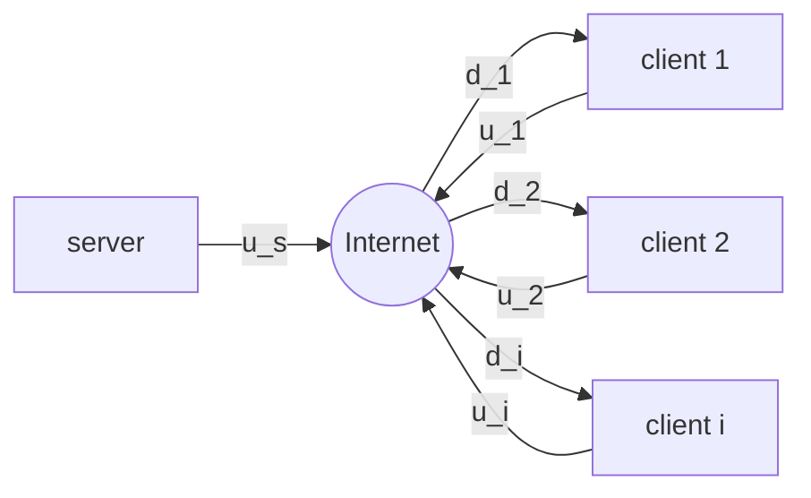

Source Type :: #📥/📄  
Note Type :: #📝  
Topics :: [[📶Computer Networking]] 
Parent Link :: [[📶Application Layer]] 

---
# 📶P2P (Peer-to-Peer)
+ Pure P2P architechture
	+ **no always on server**
	+ arbitrary end systens directly communicate
	+ peers are intermittently（間歇地） connected and change IP address
+ examples
	+ file distribution: BitTorrent
	+ Streaming: KanKan ?
	+ VoIP: Skype

## Scalability of P2P Architectures

+ <u>distribution time</u>（傳布時間）: $N$ 個 peers 都收到一份檔案副本所花費的時間。
+ Predicate
	+ the upload rate of the server’s access link: $u_s$
	+ the upload rate of the ith peer’s access link: $u_i$
	+ the download rate of the ith peer’s access link: $d_i$
	+ the size of the file to be distributed: $F bits$
	+ the number of peers that want to obtain a copy of the file: $N$
+ Consequence
	+ For client-server
		+ server transmission
			+ time to send one copy: $F\ /\ u_s$
			+ time to send N copies: $NF\ /\ u_s$
		+ client
			+ $d_{min} = max\{d_1,\ d_2,...,\ d_N\}$
			+ min client download time: $F\ /\ d_{min}$
		+ distribution time: $$D_{cs} \ge max\bigg\{\frac{NF}{u_s}, \frac{F}{d_{min}}\bigg\}$$
			+ 只要 $N$ 夠大，$D_{cs}$ 就是 $NF\ /\ u_s$。
			+ 因此 $D_{cs}$ 可視為隨著 $N$ 的增加而線性增加。
	+ For P2P
		+ server transmission
			+ at least upload one copy: $F\ /\ u_s$
		+ client
			+ min client download time: $F\ /\ d_{min}$
		+ client
			+ $u_{total} = u_s + \sum^N_{i=1}u_i = u_s + u_1 + u_2 + ... + u_N$
			+ max upload rate: $NF\ /\ u_{total}$
		+ distribution time: $$D_{P2P} \ge max\bigg\{\frac{F}{u_s}, \frac{F}{d_{min}}, \frac{NF}{u_{total}}\bigg\}$$
			+ 只要 $N$ 夠大，$D_{P2P}$ 就是 $NF\ /\ u_{total}$。
			+ 因此 $D_{P2P}$ 可視為隨著 $N$ 的增加而非線性增加。

![[client-server versus P2P.png]]

## BitTorrent
+ **torrent（奔流）:** 所有參與檔案傳輸的 peers
+ file divided into 256KB chunks（一般來說）
+ **tracker（追蹤者）:** 基礎節點，記錄所有在 torrent 中的 peers。

- 當 Alice 加入 torrent 中時
	1. 向 tracker 登錄自己
	2. 向 tracker （隨機）取得一份 peers list
	3. 嘗試向 list 上的所有 peers 建立 TCP connections
	4. 若成功建立連線，該節點稱為 **neighbors**
	5. ==neighbor 數量會隨著時間（節點增加、離開）而改變。==

- 任一時刻，每個 peers 都持有部份的 chunks，不同 peers 持有不同的 chunks
- 週期性的，Alice 詢問所有 neighbors，取得他們所擁有的 chunks lists
- requesting
	- Alice 向 neighbors request missing chunks, with <u>rarest first</u>（最稀有者優先）
		- rare 的定義: 在其 neighbors 中重複副本最少的 chunks
		- **rarest first:** 期望能平均分配 torrents 中每個 chunks 的副本數量。
- sending: tit-for-tat（以德報德）
	- Alice 選擇**四個** neighbors, which currently sending her chunks at highest speed
		- 這四個 neightbors 被稱為 unchoked（無阻的）
		- 每隔 **10 秒**，Alice 會重新計算傳輸速率，並重新選擇最高速率的四個節點
	- every 30 seconds, Alice 會隨機選擇一個 extra peer
		- 這個 peer 被稱為 <u>optimistically unchoked</u>（樂觀無阻的）
		- 這個 peer 可能成為 unchoked 中的一個
			- 意思是這個 peer 是試用的。
	- consequence
		- 每次選４＋１個 peers。
		- 其他 peers 被稱為 choked（受阻的）。
		- 如此一來，能夠找到<u>與自己最匹配的 peers</u>（傳輸速率最高的），加快總傳輸速度。
- 還有其他特性:
	- pieces（切片） (mini-chunks（迷你片段）)
	- pipelining（管線化）
	- random first selection（隨機優先選擇）
	- endgame mode（終局模式）
	- anti-snubbing（冷落情形的防範）
	- ...

## DHT (Distributed Hast Table)（分散式雜湊表）
一個簡單的資料庫，資料庫紀錄分佈在 P2P 系統中的各個 peers 中。
+ 已廣泛實施
	+ e.g. BitTorrent
+ 一直是廣泛研究主題