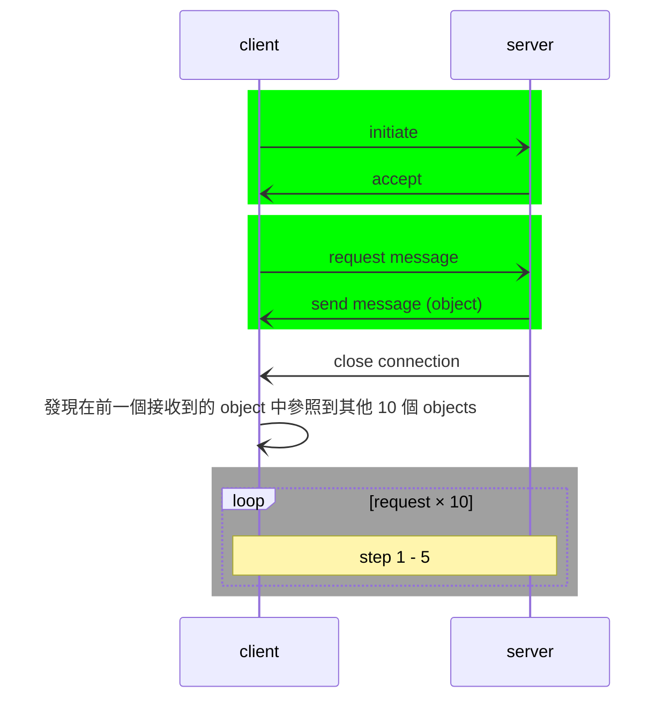

Source Type :: #📥/📄  
Note Type :: #📝  
Topics :: [[📶Computer Networking]] 
Parent Link :: [[📶Application Layer]] 

---
# 📶The Web and HTTP
## HTTP (HyperText Transfer Protocols) overview
+ Web's application layer protocols
+ web page consist of **objects**
	+ **object:** HTML files, JPEG images, Java applets, audio files...
	+ web page consists of **base HTML file**, which includes several referenced objects
	+ each object is addressable by a **URL**
		+ e.g. <ruby><u>www\.someschool\.edu</u><rp> （ </rp><rt align="center">host name</rt><rp> ） </rp></ruby><ruby><u>/someDepartment/picture.gif</u><rp> （ </rp><rt align="center">path name</rt><rp> ） </rp></ruby>
+ HTTP is **stateless protocol**
	+ server maintains no information about past client request

### client-server model
+ **client:** browser that **requests**, **receives** (using HTTP) and "displays" Web objects.
+ **server:** Web server that **sends** (using HTTP) objects in response to requests.

### using TCP
1. client initiate TCP connection (create socket) to server, port 80
2. server accepts TCP connection from client
3. HTTP messages exchanged between browser (HTTP client) and Web server (HTTP server)
4. TCP connection closed

## HTTP connections
### non-persistent HTTP
+ at most one object sent over TCP connection
	+ connection then closed
+ downloading multiple objects required multiple connection

#### response time
+ RTT (Round Trip Time)
	+ **Definition:** time for small packet to travel from client to server and back
+ HTTP response time
	+ 2RTT + file transmission time
![[non-persistent HTTP response time.excalidraw]]

#### issues
+ requires 2 RTTs per objects
+ browsers often open **parallel TCP** connections to fetch referenced (from requested files) objects

### persistent HTTP
+ multiple objects can be sent over single TCP connection between client and server
+ server leaves connections open after response
+ client sends requests as soon as it encounters a referenced object

#### response time
+ (2RTT + T) + (RTT + T) \* 10
	+ T: file transmission time

> ##### pipelining => 一次 request 全部 referenced objects
> + (2RTT + T) + RTT + 10T

## HTTP request message
request and response

### request message

	
request Example

	GET /index.html HTTP/1.1\r\n  
	Host: www.someschool.edu\r\n  
	Connection: close\r\n  
	User-agent: Mozilla/5.0\r\n  
	Accept-language: fr\r\n  
	\r\n

![[request message format.png]]

+ 每行末尾都有 carriage return（歸位） 和 line feed（換行）
	+ 最後一行只有 cr 和 lf
+ 第一行為 request line
	+ Method
		+ GET, POST, HEAD, PUT, DELETE...
	+ URL
		+ e.g. 若 Method 為 GET，URL 為請求之物件。
	+ HTTP Version
+ 後續的行（到 \\r\\n 為止）則為 header line
	+ in Example
		+ Host: www\.someschool\.edu
			+ 請求之物件所在之 host
		+ Connection: close
			+ 瀏覽器告知 server 要使用 non-persistent connection
		+ User-agent: Mozilla/5.0
			+ 使用者代理程式（瀏覽器）
		+ Accept-language: fr
			+ 希望收到該物件的法文版，若無則傳送預設版本。
+ 最後為 entity body
	+ GET 用不到
	+ POST 會用到

#### other methods
- POST (HTTP/1.0)
	- use it when the user fills out a form
	- entity body: form content
	- 經常使用 GET 代替: 加在 URL 裡
		- e.g. fill form with monkeys & bananas
			- www\.somesite\.com/animalsearch?monkeys&bananas
- HEAD (HTTP/1.0)
	- 跟 GET 類似，但會忽略請求之物件，回傳一則 HTTP message。
	- 通常用於 Debug
- PUT (HTTP/1.1)
	- 上傳 object 到 web server
- DELETE (HTTP/1.1)
	- 刪除 web server 上的 object

### response message

	
response Example

	HTTP/1.1 200 OK\r\n  
	Connection: close\r\n  
	Date: Tue, 18 Aug 2015 15:44:04 GMT\r\n  
	Server: Apache/2.2.3 (CentOS)\r\n  
	Last-Modified: Tue, 18 Aug 2015 15:11:03 GMT\r\n  
	Content-Length: 6821\r\n  
	Content-Type: text/html\r\n  
	\r\n  
	(data data data data data ...)

![[response message format.png]]

+ 第一行為 status line
	+ http version
	+ status code
	+ status phrase
+ header line
	+ in Example
		+ Connection: close
			+ server 告知 browser 送出 message 後就要 close TCP connection
		+ Date: Tue, 18 Aug 2015 15:44:04 GMT
			+ 送出 response message 的時間與日期
		+ Server: Apache/2.2.3
			+ 用 Apache 建的 server
		+ Last-Modified: Tue, 18 Aug 2015 15:11:03 GMT
			+ object 建立或最後修改時間與日期
		+ Content-Length: 6821
			+ number of bytes in the object being sent
		+ Content-Type: text/html
			+ 指出 entity body 中的 object 是 html file
+ entity body

#### HTTP response status codes and phrase
- some sample codes
	- 200 OK
		- request succeeded, requested object later in this message
	- 301 Moved Permanently
		- request object moved, new location specified later in this message (Location:)
	- 400 Bad Pequest
		- request message not understood by server
	- 404 Not Found
		- request document not found on this server
	- 505 HTTP Version Not Supported

## User-Server Interaction (State): Cookie

+ cookie have four components:
	+ a cookie header line in the **HTTP response message**
	+ a cookie header line in the **HTTP request message**
	+ a cookie file **kept on the user’s end system**, managed by the user’s browser
	+ a back-end database at the Web site

![[cookie.excalidraw]]

+ what can be use for
	+ authorization
	+ shopping carts
	+ recommendations
	+ user session state (Web e-mail)
	+ ...

### privacy
+ cookies permit site to learn a lot about user
	+ e.g. name, e-mail, password, address...

## Web caching（網頁快取） (Proxy server（代理伺服器）)
