Source Type :: #📥/📄  
Note Type :: #📠 
Topics :: [[📶Computer Networking]] 
Parent Link :: [[📶Application Layer]] 

---
# 📶The Web and HTTP
## HTTP (HyperText Transfer Protocols) overview
+ Web's application layer protocols
+ web page consist of **objects**
	+ **object:** HTML files, JPEG images, Java applets, audio files...
	+ web page consists of **base HTML file**, which includes several referenced objects
	+ each object is addressable by a **URL**
		+ e.g. <ruby><u>www\.someschool\.edu</u><rp> （ </rp><rt align="center">host name</rt><rp> ） </rp></ruby><ruby><u>/someDepartment/picture.gif</u><rp> （ </rp><rt align="center">path name</rt><rp> ） </rp></ruby>
+ HTTP is **stateless protocol**
	+ server maintains no information about past client request

### client-server model
+ **client:** browser that **requests**, **receives** (using HTTP) and "displays" Web objects.
+ **server:** Web server that **sends** (using HTTP) objects in response to requests.

### using TCP
1. client initiate TCP connection (create socket) to server, port 80
2. server accepts TCP connection from client
3. HTTP messages exchanged between browser (HTTP client) and Web server (HTTP server)
4. TCP connection closed

## HTTP connections
### non-persistent HTTP
+ at most one object sent over TCP connection
	+ connection then closed
+ downloading multiple objects required multiple connection

```mermaid
sequenceDiagram;
	participant client;
	participant server;
	
	rect rgb(0, 255, 0)
		client -) server: initiate;
		server -) client: accept;
	end
	rect rgb(0, 255, 0)
		client -) server: request message;
		server -) client: send message (object)
	end
	
	server -) client:close connection;
	client -) client: 發現在前一個接收到的 object 中參照到其他 10 個 objects
	
	rect rgb(160, 160, 160)
	loop request × 10
		Note over server, client: step 1 - 5
	end
	end
```

#### response time
+ RTT (Round Trip Time)
	+ **Definition:** time for small packet to travel from client to server and back
+ HTTP response time
	+ 2RTT + file transmission time
![[non-persistent HTTP response time.excalidraw]]

#### issues
+ requires 2 RTTs per objects
+ browsers often open **parallel TCP** connections to fetch referenced (from requested files) objects

### persistent HTTP
+ multiple objects can be sent over single TCP connection between client and server
+ server leaves connections open after response
+ client sends requests as soon as it encounters a referenced object

#### response time
+ (2RTT + T) + (RTT + T) \* 10
	+ T: file transmission time

##### pipelining => 一次 request 全部 referenced objects
+ (2RTT + T) + RTT + 10T

## HTTP request message
