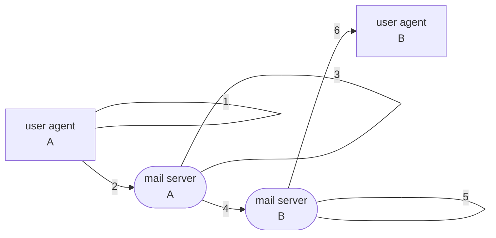
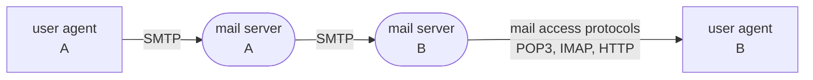

Source Type :: #📥/📄  
Note Type :: #📝  
Topics :: [[📶Computer Networking]] 
Parent Link :: [[📶Application Layer]] 

---
# 📶Electronic Mail in the Internet

+ three components
	+ user agents (mail reader)
		+ composing, editing, reading mail messages
		+ e.g. Outlook, Thunderbird, iPhone mail client
	+ mail servers
		+ components
			+ **mailbox:** contains incoming messages for user
			+ **message queue:** queue of outgoing nail messages
		+ for "client": sending mail server
		+ for "server": receiving mail server
	+ protocols
		+ e.g. SMTP (Simple Mail Transfer Protocol)

## SMTP (Simple Mail Transfer Protocols) \[RFC 2821\]

+ use TCP to reliable transfer email message from client to server (port 25)
+ **direct sending:** sending server to receiving server
+ phases of transfer
	+ handshaking
	+ transfer of messages
	+ closure
+ interaction format
	+ commands (client): ASCII text
	+ response (server): status code and phrase
+ ==messages must be in 7-bit ASCII== （缺點）

### Example

1. A invokes its **user agent**, provides **B’s e-mail address**, **composes a mail**, and instructs the user agent to send the mail.
2. A's user agent send mail to A's **mail server**, placing in **message queue**
3. A's mail server (client) opens **TCP connection** with B's mail server (server)
4. A's mail server **send mail data** over TCP connection
5. B's **mail server** places mail in **mailbox**
6. B invokes its **user agent** to **read mail**

#### Sample SMTP interaction

+ init TCP connection
+ S: 220 \<server-name\>
+ C: HELO \<client-name\>
+ S: 250 Hello \<client-name\>, pleased to meet you
+ C: MAIL FROM: \<\<client-user-name@client-name\>\>
+ S: 250 \<client-user-name@client-name\> ... Sender ok
+ C: RCPT TO: \<\<server-user-name@server-name\>\>
+ S: 250 \<server-user-name@server-name\> ... Recipient
+ C: DATA
+ S: 254 Enter mail, end with "." on a line by itself
+ C: Do you linke ketchup?
+ C: How about pickles?
+ C: .
+ S: 250 Message accepted for delivery
+ C: QUIT
+ S: 221 \<server-name\> closing connection

## Comparison with HTTP
| SMTP                                                 | HTTP                                                         |
| ---------------------------------------------------- | ------------------------------------------------------------ |
| push（推） protocol                                  | pull（拉） protocol                                          |
| persistent connections                               | non-persistent or persistent                                 |
| requires message to be in 7-bits ASCII               | Not impose（施加） this restriction                          |
| places all of the message’s objects into one message | encapsulates（封裝） each object in its own response message |

## Mail Message Formats
+ RFC 5322: standard for mail message format
	+ header line
		+ e.g. To, From, Subject...
		+ ==different from SMTP commands (MAIL FROM, RCPT TO...)==
	+ separated by a <u>blank line</u> (CRLF)
	+ body: the "message"
		+ ASCII characters only

## Mail Access Protocols

若 receiver 的 mail server 在 reciever's PC 上，則 receiver's PC 必須保持全天開啟。很明顯這是不實際的。 
通常 mail server 是由 ISP 所維護，多個 user 共用這個 mail server。 
當 user 要獲取 mail server 上寄給自己的郵件，須利用 **mail access protocols**。

### POP3 (Post Office Protocols-Version 3) \[RFC 1939\]
+ authorization phase
	+ client commands
		+ **user:** declare username
		+ **pass:** password
	+ server responses
		+ **\+OK:**
		+ **\-ERR:** 拼錯指令
	+ example
		+ S: \+OK POP3 server ready
		+ C: user bob
		+ S: \+OK
		+ S: pass hungry
		+ C: \+OK user successfully logged on
+ transaction phase
	+ client commands
		+ **list:** list message numbers
		+ **retr:** retrieve message by number
		+ **dele:** delete
		+ **quit**
	+ example
		+ C: list
		+ S: 1 498
		+ S: 2 912
		+ S: .
		+ C: retr 1
		+ S: \<message 1 contents\>
		+ S: .
		+ C: dele 1
		+ C: retr 2
		+ S: \<message 2 contents\>
		+ S: .
		+ C: dele 2
		+ C: quit
		+ S: \+OK POP3 server signing off
+ update phase

- POP3 is stateless across sessions

### IMAP (Internet Mail Access Protocols) \[RFC 1730\]
+ keeps all messages in one place at server
+ allows user to organize messages in folders
	+ e.g. create folder, move messages between folders, search messages in specific folders...
+ keeps user state across sessions
	+ names of folders and mappings between messages IDs and folder name
+ 可以取得 message 的部份元件。

### HTTP
+ e.g. Gmail, Yahoo Mail, Hotmail...
+ receive message from mail server **via HTTP**
+ send message to mail server **via HTTP**
